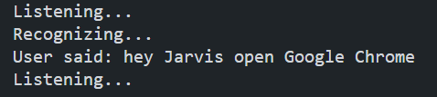

# Voice-Controlled Desktop Assistant using Python

A Python-based voice assistant that recognizes spoken commands and performs basic desktop tasks such as opening websites, fetching information, and speaking responses.

---

## Features

- Voice command recognition
- Open websites (Google, YouTube, StackOverflow)
- Wikipedia search and summary
- Speak responses using text-to-speech
- Tell current time

---

## Demo

The assistant recognizing and executing a voice command:

---

## Tech Stack

- Python
- SpeechRecognition
- pyttsx3
- Wikipedia API

---

## How to Run

1. Clone the repository
   git clone https://github.com/Parinay-Chauhan/python-voice-assistant

2. Install dependencies
   pip install -r requirements.txt

3. Run the assistant
   python main.py

  
---

## How It Works

The assistant listens to microphone input using the SpeechRecognition library.  
The captured speech is converted into text and matched with predefined commands.

Based on the recognized command, the assistant performs actions such as:

- Opening websites via webbrowser
- Fetching summaries using Wikipedia API
- Speaking responses using pyttsx3

The system runs continuously to allow real-time voice interaction.

---

## Future Improvements

- Wake-word detection ("Hey Jarvis")
- AI conversational capabilities
- Desktop automation commands
- Graphical user interface (GUI)
- Cross-platform support

---

## Author

Parinay Chauhan  
BCA Student | Aspiring Software Developer  
 
   

   
